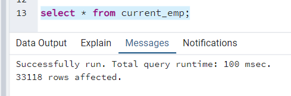
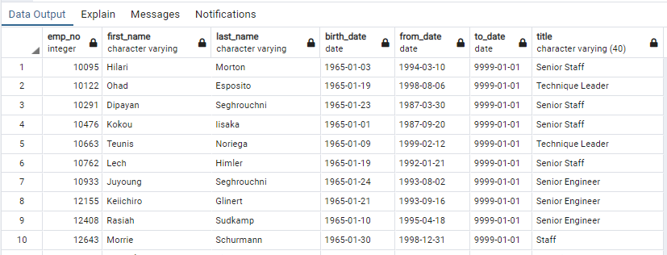

# -Pewlett-Hackard-Analysis.-
Retirement plan

## Overview
Pewlett-Hackard is a company with thousands of employees, some of wich are getting close to retirement. The company needs to know: 
 - How many people are eligible for a retiring package.
 - Which and how many positions will have an opening.

And, in order to start off a mentorship program, aimed to train the future generation: 
 - How many employees are eligible to become mentors.

Based on six CSV files provided by the company, we'll create a set of lists that hold the employee's number, name and title (among other data) who meet certain criteria, which would include them in one of the groups named above.

## Results
 
### Deliverable 1
To get the number of retirees by title, we have two options.
- Option #1: We can follow the instructions in the challenge (retrieve data from employees table) to create the next table (retirement_titles.csv). In this table there are duplicate entries for some employees because they have switched titles over the years.

 -> Seeing the duplicate entries, we need to used the DISTINCT ON statement to retrieve the most recent position.
 
   
- Option #2: We can look for the same data only this time, we search in the current employees table instead, thus getting a "clean table" (most recent title). The DataFrame we obtain would be the same one as "unique_titles.csv" wich is asked in deliverable 1 on the challenge.
 
 
  
Using the COUNT() function we will retrieve the number of employees by their most recent job title who are about to retire. The website shows us the next DataFrame as a reference of how our table should look like. 
  

 
However, the sum of these numbers (90,398) doesn't match the values obtained on the current employee table (33,118). Using the current employees table as a reference we can corroborate this value.
 

 
 An accurate version of retiring titles table, would look like the following:
 
 
  
  
### Deliverable 2
- The query (Mentorship_eligibility.txt) to create a mentorship eligibility  table, can be seen inside Employee_Database_challenge.sql file
- Next, we cant see the first ten rows from our mentorship eligibility table
 
  
  
  
  
  
 
 

